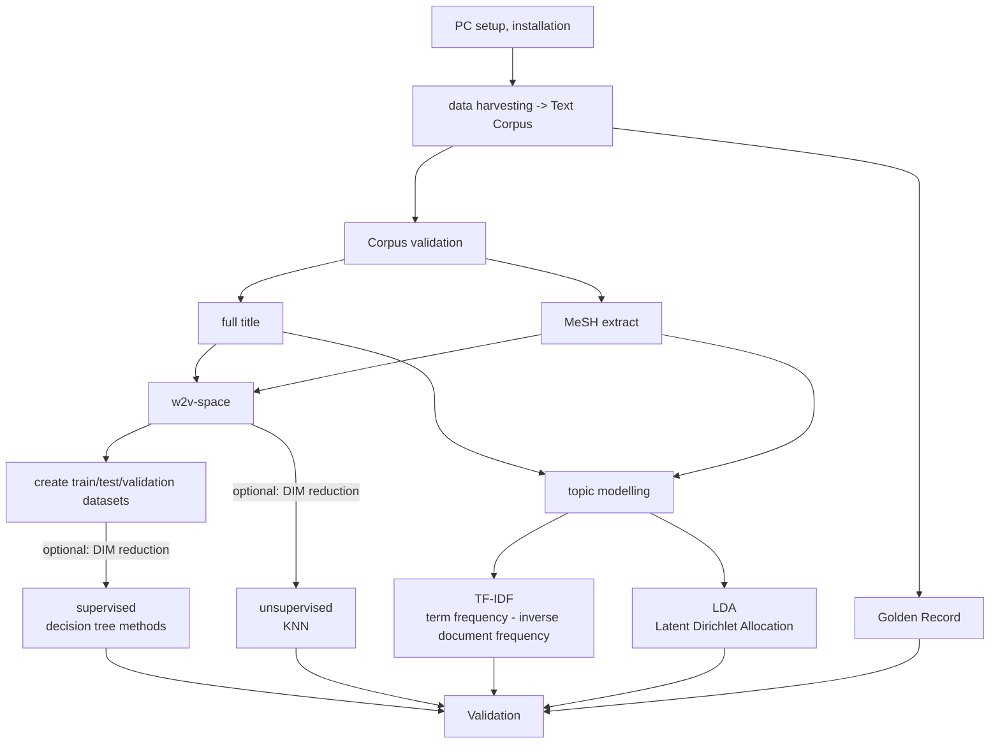
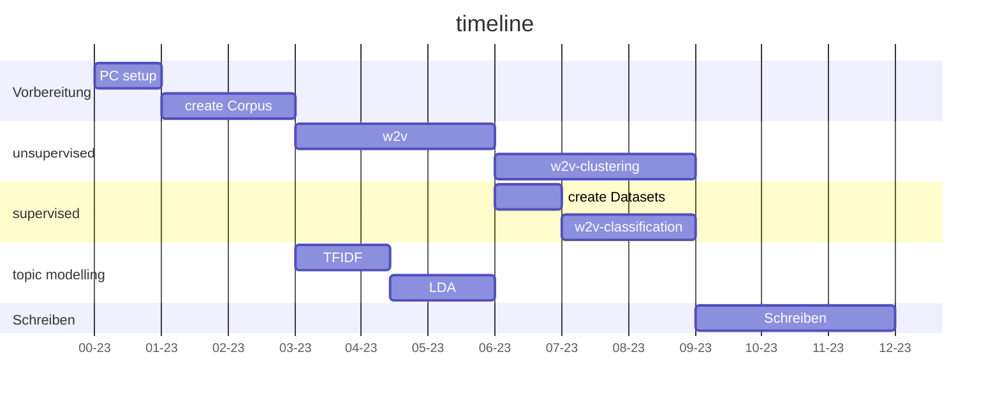

## Bachelor Arbeit:
 
Redo and improve the LIVIVO's document classification

## Infos
| was | info |
| ------ | ------ |
| Dauer |12 Wochen  |
| Start | abklären |
| Gutachter | KUF |
| Betreuer | KUF, KLI |
|Arbeitszeit | ca 2 Tage |

## Klassen
- Medizin
- Ernährung
- Umweltwissenschaften
- Landwirtschaft

## roadmap

----

        

